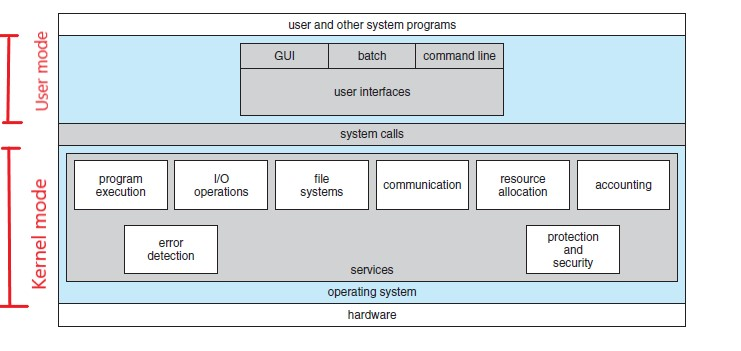
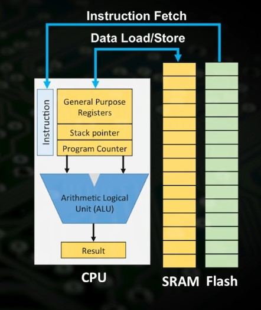
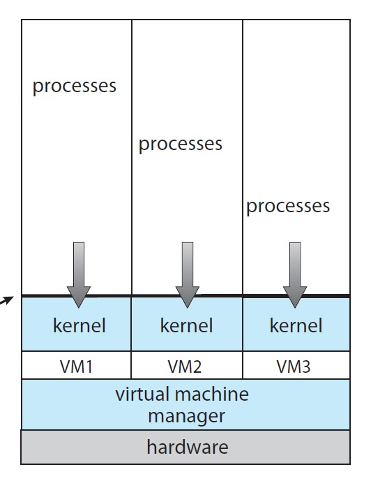

# Operative System Engineering MIT
:doctype: article
:encoding: utf-8
:lang: en
:toc: left
:numbered:
:imagesdir: images
:source-language: C

## Overview of topics
Topics include:

. Design and implementation of operating systems, and their use as a foundation for systems programming. 
. RISC-V
. Virtual memory 
. File systems
. Threads
. Context switches
. Kernels
. Interrupts
. System calls
. Interprocess communication
. Coordination, and interaction between software and hardware.

A multi-processor operating system for RISC-V, **xv6**, is used to illustrate these topics. Assignments involve extending the xv6 operating system, which resembles to unix v6, for example to support sophisticated virtual memory features and networking.

*Projects:*

* Network driver that sends packets over the internet
* Redesign memory allocator for scaling across multiple cores.
* Implement fork and make it efficient via copy-on-write.

## A little history

*1945-1955* vacuum tubes and punching cards.

**1955-65**: Transistors and batch systems:

Batch systems accumulate many jobs into tape and run all the tape at once. Separation between designers, operators, programmers(assembly or Fortran) and maintenance.

**1965-80**: ICs, multiprogramming and the birth of UNIX and Microsoft:

In the 1960s, Moore’s Law predicted that the number of transistors on an integrated circuit would **double every eighteen months**.  

The *IBM 360* (A [underline]#family of compatible computers# that ranged from low to high performance were built to satisfy the growth of the programs of the client), had the goal achieving compatibility of programs across the family of computers that share the same architecture, however that [red]#required that the piece of code(operating system) meet all the conflict requirements#(for scientific and commercial environments) which obviulsy resulted in thousands of bugs in assembly code; but managed to satisfied most of the customers reasonably well. They popularized several key techniques like the multiprogramming to *keep computer working 100% of the time by keeping 3 jobs* on different memories, utilizing the idle time that the CPU waited for IO for another job.

*(1974) 8080 First general-purpose 8-bit Intel CPU*. Kildall wrote the OS and found Digital Research, but a killing decision of not writing an OS for IBM in 1980 led Seattle Computer Products to create DOS(Disk Operating System) and Bill Gates hired *Tim Paterson* to revise it, becoming **MS-DOS**.

Doug at Standford Research did some research on GUIs and Xerox PARC adopted into the machines they built, **Steve Jobs saw them and embarked on building an Apple with a GUI(LISA)**. Second attempt succeeded because it was user friendly, meaning that it was [red]#**intended for users who not only knew nothing about computers but furthermore had absolutely no intention whatsoever of learning**#. Apple inspire Windows 95, the first freestanding version of a GUI built into a modified MS-DOS.

*MULTICS* was developed as a way to **share a computer across multiple users**(yes this is where cloud computing started) and it was a success because people knew how to write small, efficient programs(a skill that has been lost). However this effort did not take over the world because it was written in PL/I which was an obsolete compiler but many discoveries helped to develop UNIX OS.
*UNIX began with a MULTICS* version and grew into multiple incompatible versions, which led to the development of the **POSIX standard by the IEEE that standardizes interfaces to run a program into any UNIX system**.

**1980-Present**: Personal Computers MINIMIX(1987) and Linux: 

The detection and replacement of faulty/crashed modules on the fly without a reboot or disturbing running programs was its goal: reliability, dependability and availability. This system is described on Operating Systems Design and implementation (Tanenbaum & Woodhull).

Minimix led to **Linux**, a free production OS created by Linus Torvalds.
With the development of Large Scale Integration circuits, chips containing thousands of transistors, personal computers became affordable.

## Overview
A computer consist of one or more processors, main memory, registers, IO devices, memory controller and other physical components; all in one complex system as shown. 

.ARM microcontroller
image::images/1_armCore.jpg[]

The basic cycle of every CPU is to <<fetch-instruction>> the first instruction from memory, decode it to determine its type and operands, execute it, and then fetch, decode, and execute subsequent instructions. The set of instructions is specific to the architecture of the CPU, so if every application had to understand how all these things work in detail, no code would be portable. Furthermore, managing all these components optimally is challenging. This is the reason computers have a software layer called **operating system**, whose job is to provide handling of this computer model.

[[computer-stack]]
.computer stack

On top of the hardware is software, computers have two modes of operation(defined in the mode bit): **kernel mode**(0, fundamental piece of software, also called supervisor/privileged mode, which has complete access to ALL hardware and can execute ANY instruction) and **user mode**(1, subset of instructions. Forbids any instruction that affect the control of the machine or does I/O, but it has some privileged instructions, only executable on kernel mode).  
This 2 modes are blurred in embedded systems, because they may not have an OS at all. Also some programs allow the users to help the OS or perform privileged functions(syscalls).

NOTE: You can also see that *system calls* are the interface between user and kernel mode. Operative systems differ from user programs in location of residence, complexity, long-lived. The source code of Linux is on the order of 5 million lines of code. So they are hard to write, hence, not easy to replace. 

### What is an operating system?
An operating systems acts as an intermediary between the applications in a computer and the hardware(see <<computer-stack>>, so its basically a driver). The OS is a program that manages a computers resources by offering services(cpu time, memory space via file storage, IO operations). An OS can be designed to be convenient or efficient but the *main goals  of an OS are:*

* Abstract: hardware for portability and convinience.
* Multiplexing: allow multiple applications to share hardware and cooperate while isolating programs to provide security.

### Computer system organization
#### Startup:
When a computer its powered up or rebooted the bootloader runs, a simple program stored in ROM or EEPROM. It initializes all aspects of the system: from CPU registers to device controllers and memory contents. It also must know how to locate and load the OS and start executing the *kernel* (which is the program that runs all the time.)

#### Interrupts/exceptions: 

* Hardware → physical signals either from peripherals or the cpu itself. 
* Software → executing special operation called **system call**(provide means for a user to ask the OS to perform tasks reserved for the OS). 

*General interrupt/exception process*

When an exception or interrupt occurs, execution transition from user mode to kernel mode where the exception or interrupt is handled takes place as follows.

.interrupt process overview
image::images/4_overviewInterrupt.jpg[]

*Interruption process on ARM microcontrollers:*

1) To save the context:

In parallel, save(push) the address of the interrupted instruction in the Program Counter. Also, we store status register(xPSR), LR and registers R0, R1, R2, R3 and R12.

image::images/5_IRQsavestate.jpg[]

2) Then, to handle the exception or interruption:

Computer locates the IRQn on the vector table, which contains the *address of the interrupt handler(ISR)*. Finally, code on that handler function is executed and once its finished, the context is restored.

.ISR location on Vector table 
image::images/6_ISRhandler.png[]

Since only a predefined number of interrupts is possible, a table of pointers to interrupt handling routines is commonly used to provide speed, this table of pointers is stored in low memory and is called interrupt vector (inside vector table).

#### Fetching instructions:  
A CPU can load instructions only from memory, so any programs to run must be stored there. General purpose computers run the program from r/w memory (RAM). Fetch instruction receives an instruction from ROM(Flash in this case) and uses load-store instructions to process data, load moves a word or byte from main memory to internal register within CPU and store moves the content of the register to main memory

[[fetch-instruction]]
.fetch instructions

### Computer system architecture
#### Types of Data transfering

*Interrupt Driven I/O:*

The IO device send data to the device controller, which examines the contents, transfers the data and informs the CPU via interrupt(one interrupt per byte) that the IO device requires operation and the OS responds with the required operation. This works fine for small amounts of data. But produce high overhead when used for bulk data movement such as disk IO.

*DMA:*

After setting buffers, pointers and counters for IO device, device controller transfers an entire block of data directly to or from its own buffer storage to memory without CPU intervention(only one interrupt per block).

#### System processors	
*Single-processor system:*

On single processor systems, there is one main CPU capable of executing the full general purpose instruction set and user processes. However, almost all of them, have special-purpose processors to deal with specific devices or mainframes to move data rapidly. The special purpose processors run a limited instruction set, they are managed by the OS or via special hardware.

*Multiprocessor/multicore/parallel systems:* 

systems with 2 or more processor with shared bus and optionally clock, memory, peripherals. Advantages → increased throughput, economy due to sharing of electronic, reliability(ability to keep providing service proportional to the surviving hardware, also called“graceful degradation” or “fault tolerant”).

[underline]#Asymmetric multiprocessing:# each processor is assigned a specific task. A Boss processor control the system and the other attends the boss or performs predefined task(IO for example).

[underline]#Symmetric multiprocessing:#
both processors performs all task within OS. Peer processors, could serve as redundancy or to divide workload(but [red]#shared resources must be carefully controlled#)

*multicore systems:*

more efficient and less power consumption by including multiple cores(processors) on a single chip.

### OS structure
One important feature is Multiprogramming, it increases CPU utilization by allowing multiple programs/jobs(code and data) which contain processes/tasks(program loaded into memory and executing) to be executed(similar to the batch of programs) at the same time. Whenever waiting for IO or something, another job executes. Basically a time-sharing system.

The operating system is responsible for the management of:

* Scheduling processes and threads on the CPUs. And allocating the pertinent resources.
* Creating and deleting both user and system processes.
* Suspending and resuming processes
* Providing mechanisms for process synchronization
* Providing mechanisms for process communication
* Keeping track of which parts of memory are currently being used and who is using them
* Deciding which processes (or parts of processes) and data to move into and out of memory
* Allocating and deallocating memory space as needed

### Memory Management

**A) Cache: **

stores data so that future requests for that data can be served faster, the data stored in a cache might be the result of an earlier computation or a copy of data stored elsewhere. A cache hit occurs when the requested data can be found in a cache, while a cache miss occurs when it cannot. Cache hits are served by reading data from the cache, which is faster than recomputing a result or reading from a slower data store(ex. main memory); thus, the more requests that can be served from the cache, the faster the system performs(which is designed on the cache management).

For instance, most systems have an instruction cache to hold the instructions expected to be executed next. Without this cache, the would have to wait several cycles CPU while an instruction was fetched from main memory. If multiple processes affect the local copy of value A in cache, we must make sure to update and control the access for the most recent value of A, this is called “cache coherency”.

*C)	Main memory:*

R/W memory, usually too small to store all needed programs and data permanently. Volatile storage. Usually implemented in DRAM.

*D)	Virtual Memory:*

scheme that enables users to run programs larger than actual physical memory. Allows to abstract memory into a large, uniform storage array.

### Virtualization Vs Interpretation:
**Virtualization: **Allows OS to run applications within other OS. However, this emulation comes at a heavy price, every machine-level instructions must be translated to the equivalent function on the target system which often results in several target instructions.(An example of Virtual machine is Vmware or Vbox)

.virtualization

*Interpretation:* another type of emulation occurs when a computer language is not compiled to native code but instead is either executed in its high-level form or translated to an intermediate form. This is known as interpretation(Java is always interpreted, thats why we require a Java Virtual Machine).

## Operating system structures

### OS Services

## Terminology

**POSIX**, which stands for Portable Operating System Interface, represents a set of standards implemented primarily for UNIX-based operating systems.

*Linux*: Its Just the GNU project, with many UNIX-compatible tools (compilers, editors, utilities) + the kernel developed by Linus Torvalds(Linux)., resulting in GNU/Linux.

*Licenses*: General Public License: This license was created with the goal of  forbid proprietary modifications or restriction of redistribution. Free Software Foundation, want to make sure that all versions of GNU and other softwares remain free. GPL requires that source code is distributed with any binaries and that t any changes made to the source code be released under the same GPL license.

